

  

<h1 align="center">
  HardHacker Themes 
  
</h1>

A visually comfortable dark theme that is suitable for prolonged use. It differs from the typical blueish dark themes and aims to express a unique style with a more futuristic color palette.

The color inspiration comes from some cyberpunk-style art works. However, neon color schemes commonly seen in cyberpunk styles are not suitable for prolonged staring, thus the saturation of the colors has been reduced.

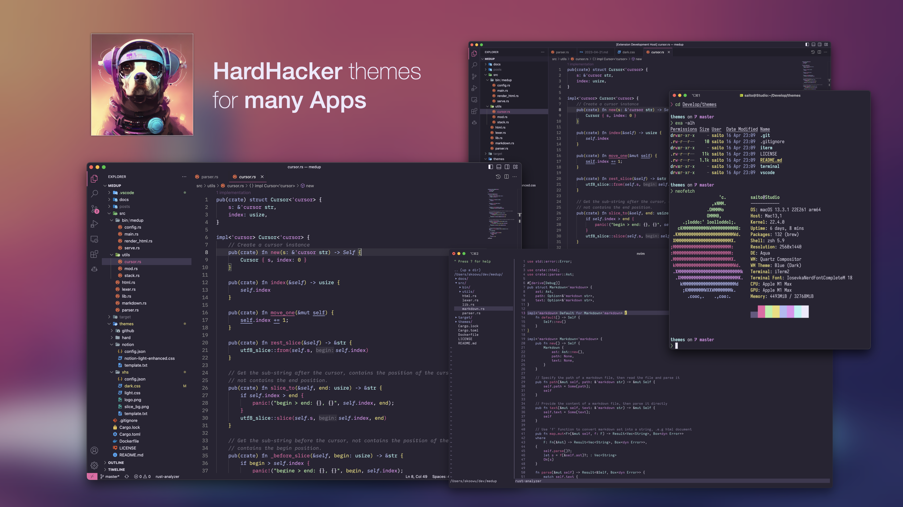

## Features

#### 🎉 Suitable for prolonged use

❤️ Color-blind friendly

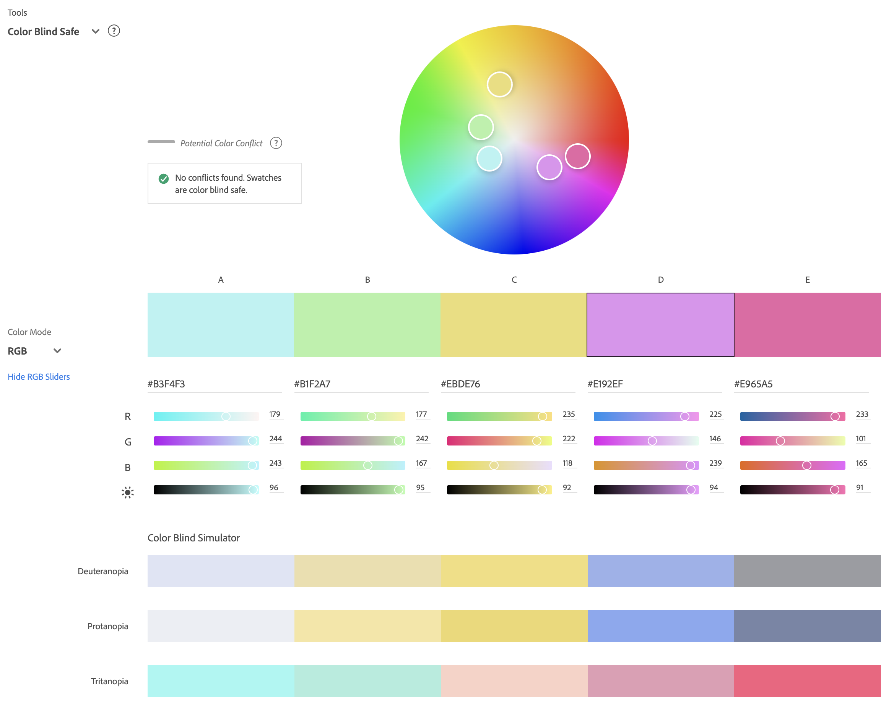

👀 Good readability, meets WCAG AA standard

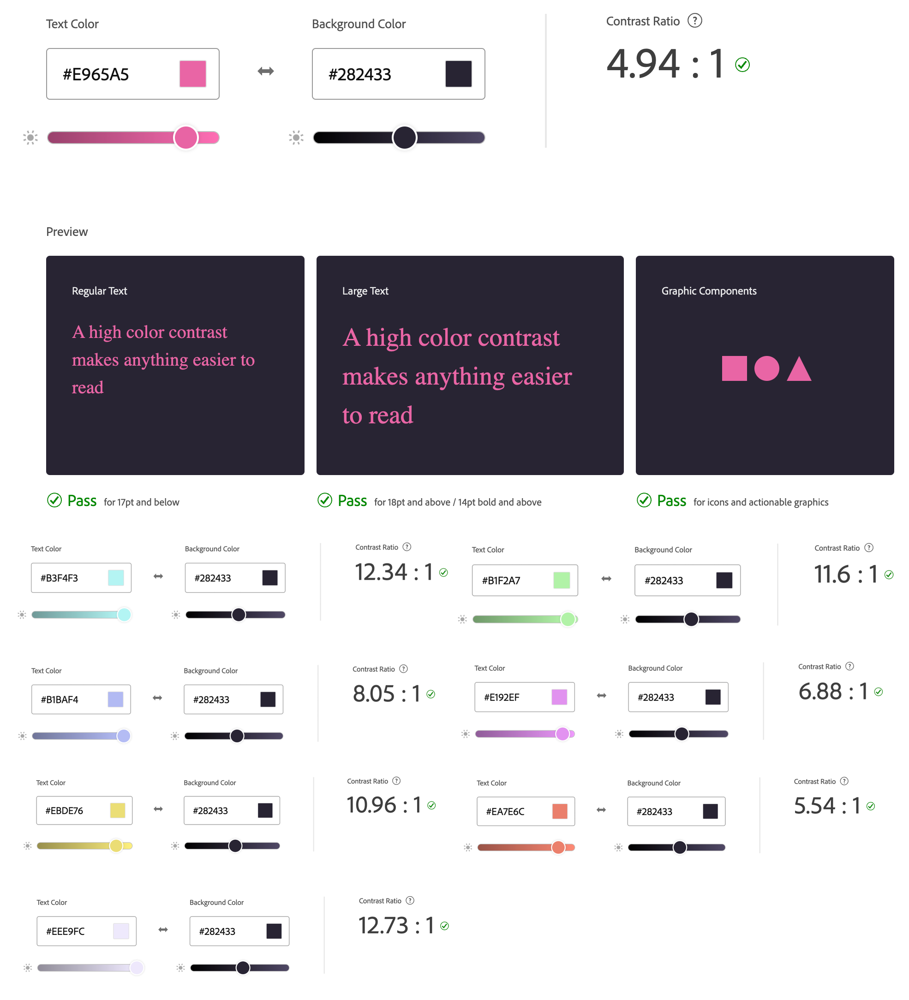

#### 🛸 Futuristic
#### 🚀 Continuously increasing support for editors and tools

## Color Palette

| Palette       | Hex         | Preview                                          |
| ------------- | ----------- | ------------------------------------------------ |
| Background    | `#282433`   | 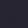       |
| Foreground    | `#eee9fc`   | 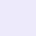       |
| Selection     | `#3f3951`   | 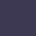         |
| Comment       | `#938aad`   | 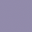             |
| Red           | `#e965a5`   |                      |
| Green         | `#b1f2a7`   | 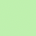                 |
| Yellow        | `#ebde76`   | 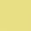               |
| Blue          | `#b1baf4`   |                    |
| Purple        | `#e192ef`   | 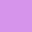               |
| Cyan          | `#b3f4f3`   |                    |

### Usage reference

* Primary color: red
* String: green
* Number: yellow
* Method: red
* Keyword: blue
* Operator: foreground
* Class: cyan
* Variable: purple

## Supports
* VSCode
* JetBrains IDEs (since version 2023)
* vim
* Sublime Text
* Emacs
* iTerm2
* macOS Terminal
* Windows Terminal
* Hyper Terminal
* Alacritty
* LSD: a rewrite of GNU `ls`
* 🚧 Building...

## Contributing
> How do I submit a new theme?
1. Create a repository based on out [template repo](https://github.com/hardhackerlabs/theme-template).
2. Build your new theme with our color palette.
3. Submit an issue contains a link to your repository.
4. We will move the repository to HardHackerLabs organization and give you rights.

## Sponsers
* Podcast HardHacker

  <a href="https://podcasts.apple.com/au/podcast/%E7%A1%AC%E5%9C%B0%E9%AA%87%E5%AE%A2/id1678465783" target="_blank" rel="noopener noreferrer">
    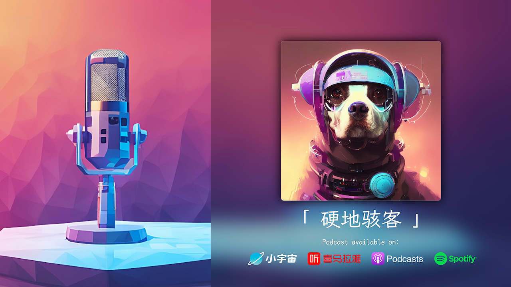
  </a>

