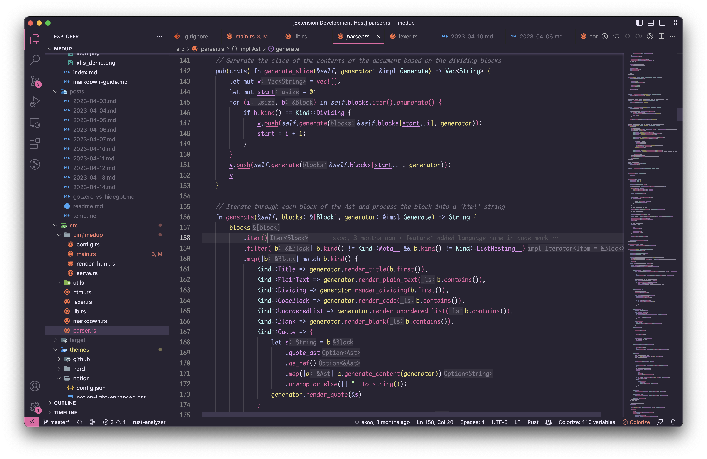
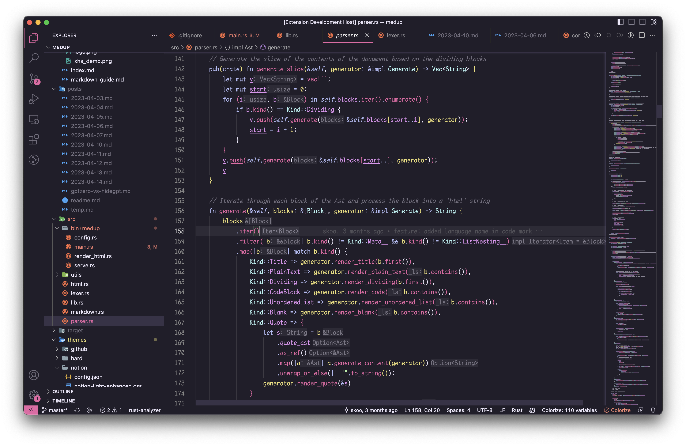

# Hard Hacker Theme

A visually comfortable dark theme that is suitable for prolonged use. It differs from the typical blueish dark themes and aims to express a unique style with a more futuristic color palette.

The color inspiration comes from some cyberpunk-style art works. However, neon color schemes commonly seen in cyberpunk styles are not suitable for prolonged staring, thus the saturation of the colors has been reduced.

**Features:**
* Suitable for prolonged use
* Color-blind friendly
* Good readability
* Futuristic
* Provides high-contrast options

**Color Palette:**
| Palette       | Hex         | Preview                                          |
| ------------- | ----------- | ------------------------------------------------ |
| Background    | `#282433`   |        |
| Foreground    | `#eee9fc`   |        |
| Selection     | `#3f3951`   |          |
| Comment       | `#eee9fc66` |           |
| Red           | `#e965a5`   |                      |
| Green         | `#b1f2a7`   |                  |
| Yellow        | `#ebde76`   |                |
| Blue          | `#b1baf4`   |                    |
| Purple        | `#e192ef`   |                |
| Cyan          | `#b3f4f3`   |                    |
| Bright Black  | `#655980`   |  |

**Color-blind safe:**

**Enough contrast(normal theme):**

**Screenshot:**
* Normal

* Darker

**Support:**
* VSCode
* Iterm2
* Terminal
* 🚧Building...
