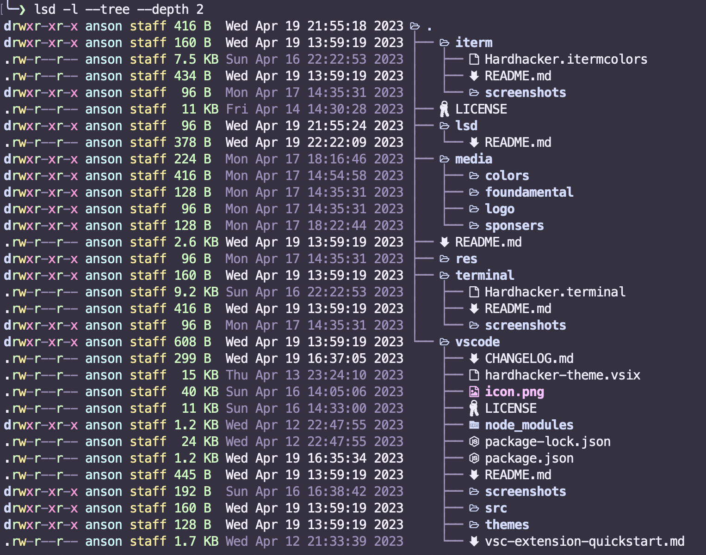

# Hard Hacker Theme for LSD

Hard Hacker Theme for [LSD](https://github.com/lsd-rs/lsd)



## Install

1. Download or clone this repo.
2. Copy `hardhacker.yaml` to `~/.config/lsd/themes/`.
3. Edit `~/.config/lsd/config.yaml`, create it if doesn't exist.
```yaml
color:
  theme: hardhacker
```

For more information please check [lsd](https://github.com/lsd-rs/lsd#configuration).
