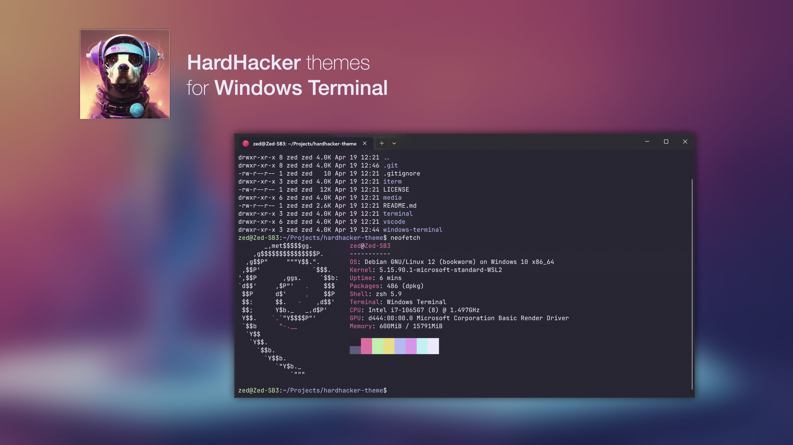

# Hard Hacker Theme for Windows Terminal



## Features:
* Suitable for prolonged use
* Color-blind friendly
* Good readability
* Futuristic

## Install

Copy `theme.json`'s content , paste to Windows terminal's settings.json `schemes` array,
and then change `profiles.colorScheme` to `Hardhacker`。

```json
...
"profiles": {
    "colorScheme": "Hardhacker",
    ...
},
"schemes": [
        {
            "name": "Hardhacker",
            ...
        }
]
```
